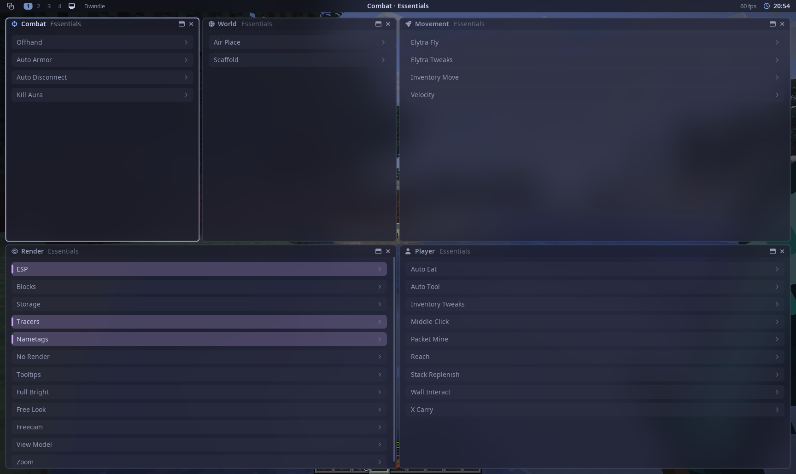
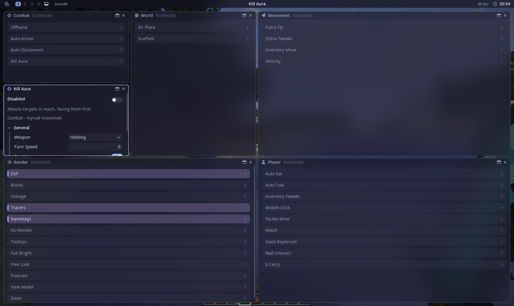
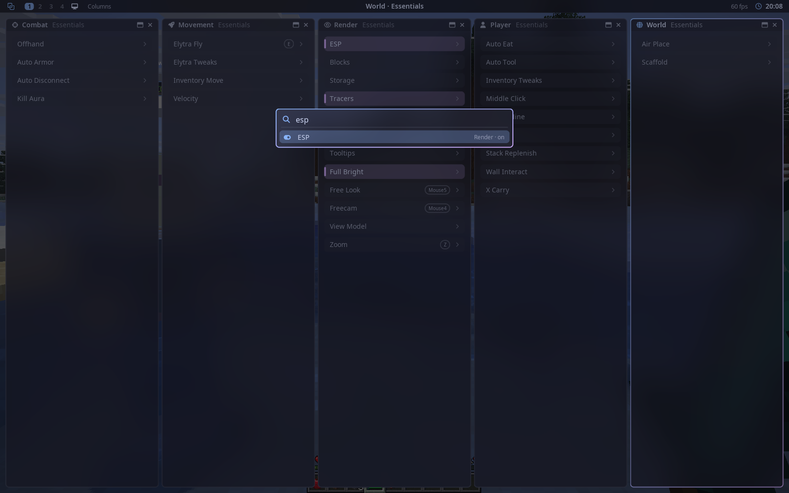
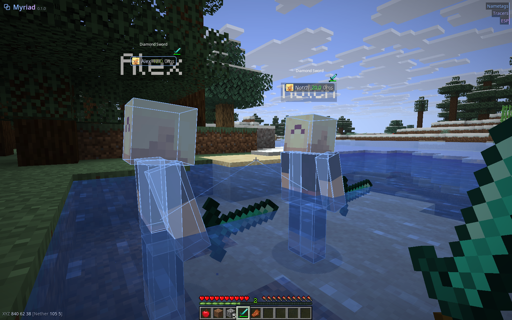
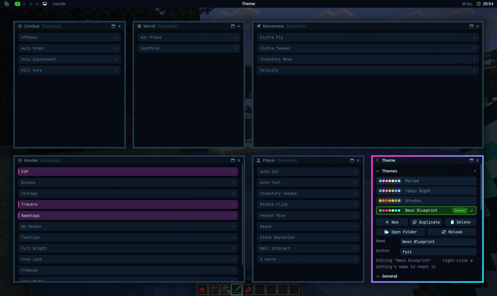
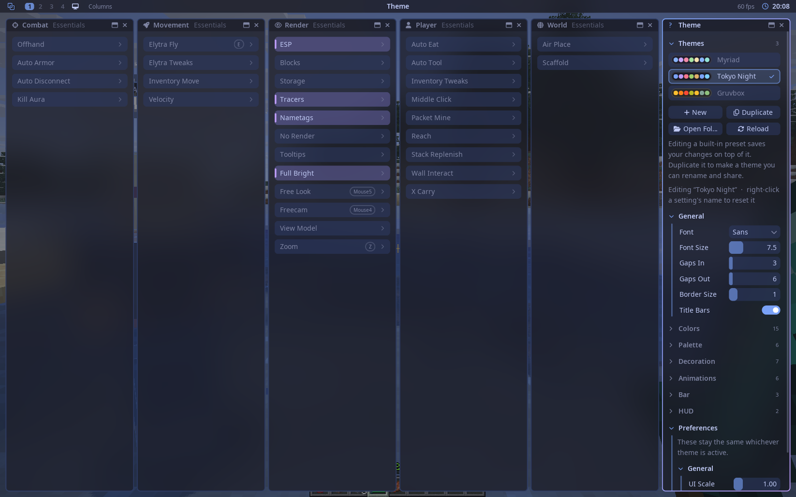
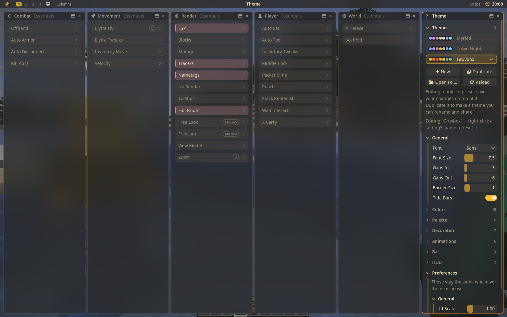
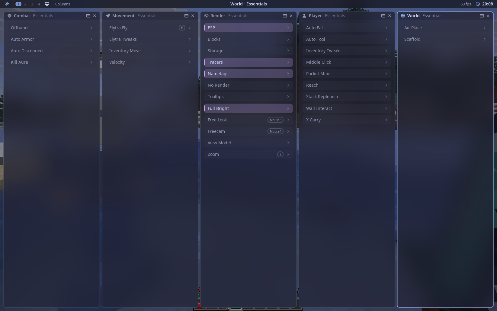

<p align="center"></p>
<h1 align="center">Myriad</h1>
<p align="center">An addon-first utility client for Minecraft 26.2, with a menu that works like a tiling window manager.</p>
<p align="center"><a href="https://myriadclient.dev/"><b>myriadclient.dev</b></a></p>
<p align="center">
  <a href="https://github.com/fyzz-dev/myriad/releases"></a>
  <a href="https://github.com/fyzz-dev/myriad/actions/workflows/build.yml"></a>
  
  
  
</p>



Myriad is built like a desktop, not a click-GUI. The menu is a window manager modelled on
[Hyprland](https://hyprland.org): workspaces, tiled or floating windows, layouts, a launcher, and everything reachable
from the keyboard. The core ships **no modules at all**. Every feature, including the stock set, is an addon written
against the public API, so the client is whatever addons you put next to it.

- **Workspaces and layouts.** Nine workspaces, each tiling its windows with Dwindle or Columns. Lay out a
  combat workspace and a base workspace, merge windows, float the ones you want on top.
- **Launcher.** `Alt+Space` fuzzy-searches modules, panels, themes, profiles and workspaces. Enter toggles, Shift+Enter
  opens settings.
- **Themes.** Gaps, borders, rounding, blur, shadows, animations, fonts and every colour. Presets, your own, and a
  palette that modules follow, so ESP, tracers and the HUD match whatever you pick.
- **Made for 2b2t.** The stock modules pass Grim by default; the services every addon builds on (placing, breaking,
  rotating, inventory) are timed and ordered for it, and switch to faster behaviour on servers that don't check.
- **Cheap by design.** A module costs nothing until it does something, and the built-in profiler shows what each one
  costs.
- **Addon-first.** One API, a template, a reference addon, and a compatibility promise, so an addon built today keeps
  working on the next release.

## Install

1. [Fabric Loader](https://fabricmc.net/use/) for Minecraft 26.2, and [Fabric API](https://modrinth.com/mod/fabric-api).
2. Put `myriad-<v>.jar` from the [latest release](https://github.com/fyzz-dev/myriad/releases/latest) in `mods/`,
   with `myriad-essentials-<v>.jar` from [its releases](https://github.com/fyzz-dev/myriad-essentials/releases/latest)
   and any other addons.
3. In game, press **Right Shift**.

### Updates

Myriad checks GitHub for new releases of itself and of each addon when the game starts. When there is one, a pill
with the new version shows on the addon's card in the **Addons** window (and a count in the bar); open the card and
click **Update**, or **Update all**, or use `.update`. The jar is downloaded and checked (the right mod and version,
and that it supports your Minecraft and Myriad), then swapped into `mods/` when you quit, so the next launch runs it.
The jar it replaced is kept in `.minecraft/myriad/updates/old/`. Turn the check off with the toggle at the top of
the Addons window.

## Official addons

| Addon | What it adds | Where |
|---|---|---|
| **Myriad Essentials** | The stock modules: Offhand, Kill Aura, Elytra Fly, Packet Mine, Scaffold, ESP, Nametags and the rest, with the HUD elements. Built like any other addon, on the public API, versioned on its own; remove it and Myriad boots with an empty module list. | [fyzz-dev/myriad-essentials](https://github.com/fyzz-dev/myriad-essentials) |
| **Myriad Boze** | Every module of the [Boze](https://boze.dev) client in Myriad's menu, with Boze installed alongside: Boze's modules appear in the shared categories (*Combat · Boze*) with their settings, keybinds and on/off state in sync both ways, and the two friend lists kept the same. Boze stays the owner of its config and keys; Myriad is a second front end. | [fyzz-dev/myriad-boze](https://github.com/fyzz-dev/myriad-boze) |
| **Myriad Omarchy** | A theme that follows your [Omarchy](https://omarchy.org) system theme: switch themes on the desktop and the menu follows. | [fyzz-dev/myriad-omarchy](https://github.com/fyzz-dev/myriad-omarchy) |

For writing your own: [myriad-addon-template](https://github.com/fyzz-dev/myriad-addon-template) to start from and
[`example-addon/`](example-addon) to read. See [Writing an addon](#writing-an-addon).

## A look around

| | |
|---|---|
|  |  |
| A module's settings, inline under the module or in a window of their own, which Dwindle tiles in beside it. | The launcher: type a few letters, Enter toggles. |
|  |  |
| In game: ESP, tracers and nametags from Essentials, the HUD drawn by the same window manager. | A theme of your own: square corners, wide gaps, a thick gradient border, a mono font, dimmed inactive windows. It's one JSON file ([`docs/themes/neon_blueprint.json`](docs/themes/neon_blueprint.json), drop it in `.minecraft/myriad/themes/`). |
|  |  |
| The Theme panel, on the Tokyo Night preset. Every colour, gap and curve is a setting. | Gruvbox. Editing a preset saves your changes on top of it. |
|  | |
| The Columns layout, one category per column; `mod+L` cycles layouts per workspace. | |

## Building and running

Requires JDK 25+.

```bash
./gradlew build                          # core/ and example-addon/ → */build/libs/*.jar
./gradlew :core:test                     # unit tests: event bus, settings, config, layout, the API surface
./gradlew :core:runClient                # core only (no modules)
./gradlew :example-addon:runClient       # core + the released Essentials + the example addon
./gradlew :example-addon:runClient -PessentialsDir=../myriad-essentials   # …with the Essentials jar built in that checkout
./gradlew :example-addon:runClient -PopenDesktop   # …and open the menu on the title screen
./gradlew :example-addon:runClient -PquickPlay="New World"   # …or load straight into a singleplayer world
./gradlew :example-addon:runClient -PscreenshotEvery=10   # …saving a screenshot every 10 s (run/screenshots)
./gradlew :example-addon:runClient -PquickPlayServer=localhost:25565 -Pusername=GrimTester   # …or join a server
./gradlew publishToMavenLocal            # dev.myriad:myriad in ~/.m2, to build an addon against unreleased changes
```

```
core/           mod id "myriad"             the platform: API, event bus, config, commands, renderer, menu
example-addon/  mod id "myriad-example"     the reference addon: a complete feature set, written to be read (not released)
```

The stock modules live in [myriad-essentials](https://github.com/fyzz-dev/myriad-essentials), with the Grim test
server and suite that check them against 2b2t's anti-cheat. The dev client takes script steps from
`run/myriad-dev-inbox` (commands, movement, the menu, screenshots); the README's pictures are taken that way.

Releases are tagged: `git tag v0.1.0 && git push origin v0.1.0` builds, tests, attaches the core jar to a GitHub
release and publishes it to the maven at `https://fyzz-dev.github.io/myriad`. Essentials and the other addons
release from their own repositories, to the same maven.

## The menu

Press **Right Shift** (rebindable) in game or on the title screen to open the Myriad menu.

- **Workspaces 1–9** each tile their windows with a layout. **Dwindle** is the default, as in Hyprland: each new
  window splits the focused one, so a workspace grows into a grid. **Columns** (one window per module category, side
  by side, with each module's settings unfolding inline) is also built in, and addons can register
  more layouts.
- **Category windows** hold one addon's modules in one category: *Combat · Essentials*, *Combat · Crystal PvP*. Addons
  share the standard categories (same icon and colour) and can add their own. Lay them out however suits you, say a
  combat workspace and a base workspace; when you install an addon, its windows open on the workspace that already
  has that category, and a notification says where. A window you close stays closed (the launcher reopens it).
  **Merge** windows by dragging one by its title bar onto another's title bar: each addon becomes a section, and the
  icon on a section's header moves it back out to its own window.
- Windows can be **tiled**, **floating** or **fullscreen**. Drag the gaps between tiles to resize them.
- The bar shows workspaces 1–4, and 5–9 only while they have windows (or you're on one). The **HUD workspace** (the icon after
  the numbers) holds the in-game HUD. Its windows are drawn in game without
  window decorations. Drag them to move them; they snap to edges and to the centre, and anchor to the nearest screen
  third. Right-click one for its settings. The **HUD** window there lists every element like a category lists
  modules: click one to add or remove it, unfold it for its options. Delete removes the hovered element, and the
  launcher can also add and remove them.
- The **launcher** (`Alt+Space`) fuzzy-searches modules (Enter toggles, Shift+Enter or right-click opens settings),
  panels, categories, themes, profiles and workspaces.
- **Themes**: a theme holds the whole look: gaps, borders (gradient, optional rotation), rounding, blur, shadows,
  inactive dimming and opacity, animation curves and speeds (Hyprland-style), the bar, fonts, and every colour. Pick
  one in the Theme panel and edit it there; edits save into the active theme as you make them.
  - **Presets**: Myriad, Tokyo Night and Gruvbox. Editing a preset saves your changes on top of it (it shows
    *Edited*), and **Reset** brings the original back.
  - **Your themes**: **New** or **Duplicate** makes a theme you can rename and give an author. Each one is a file in
    `.minecraft/myriad/themes/`. To share it, send the `.json`; the other person drops it in that folder and presses
    **Reload**.
  - **Theme roles**: colours come from a palette (accent, secondary, red, green, yellow, blue, magenta, cyan) that
    modules use as defaults, so ESP, tracers, categories, notifications and the module list follow the theme. A
    colour you change on a module is saved with that module's settings as an override.
  - **Preferences** (UI scale, pausing singleplayer, mod key, vim keys) are yours, not the theme's, and stay put when
    you switch.
- **Profiler** (a window from the launcher): milliseconds per second spent by every module, service and listener in
  tick, render and other handlers, so a slow addon is a glance away. Timing runs only while it's open.

Default shortcuts follow [Omarchy](https://omarchy.org)'s tiling bindings. The mod key stands in for Super, which
Hyprland keeps for itself, and defaults to **Alt** (change it in Theme → Preferences):

| Keys | Action |
|---|---|
| `mod+Space` | launcher (Ctrl+j/k to move, Enter to run, Shift+Enter for the alternate action) |
| `mod+Return` / `mod+K` | console / keybindings |
| `mod+W` / `mod+T` / `mod+F` | close / toggle floating / full screen |
| `mod+J` / `mod+L` | toggle split / toggle workspace layout (Columns, Dwindle) |
| `mod+1..9` / `mod+Shift+1..9` | switch workspace / move window there |
| `mod+Tab`, `mod+Shift+Tab`, `mod+Ctrl+Tab`, `mod+scroll` | next / previous / former workspace |
| `mod+S` / `mod+Shift+S` | toggle the HUD workspace (Omarchy's scratchpad) / move window to the HUD |
| `mod+Arrows` / `mod+Shift+Arrows` | focus / swap in that direction |
| `mod+-` / `mod+=` | shrink / grow window |
| `mod+Shift+Space` / `mod+Shift+Backspace` | toggle the bar / toggle gaps |
| `mod+LMB drag` / `mod+RMB drag` | move (floating) or swap (tiled) / resize: tiled windows move their nearest edges, floating windows their nearest corner |

With Omarchy, Hyprland itself takes `Alt+Tab`. Use `mod+scroll` instead, or pick another mod key.

**Inside a window** everything is reachable from the keyboard. `j`/`k` (or ↓/↑) move the selection, and `h`/`l` (or
←/→) adjust a value or fold/unfold a section. `Enter`/`Space` activate, `o` unfolds a module's settings, `gg`/`G`
jump to the top/bottom, `Ctrl+d`/`Ctrl+u` move half a page, and `/` focuses the filter. Esc leaves a text field, or
closes the menu.

Every binding can be changed in the Keybinds panel.

## Essentials

The stock modules are the [myriad-essentials](https://github.com/fyzz-dev/myriad-essentials) addon, released on its
own. In the standard categories (each module's settings explain its options):

| | |
|---|---|
| Combat | **Offhand** (totem, crystal, golden apple or shield, falling back to a totem when it matters; sword gap), **Auto Armor** (best armour; a bind flips chestplate and elytra), **Auto Disconnect** (health, totem pops, totems left, armour, players, beds, anchors, crystals, creepers, falls, the void, chosen entities; turns off or waits for the reason to clear), **Kill Aura** (Grim-safe: faces the target with move fix and hits when this tick's or the last sent rotation lands on its hitbox within reach, so the turn and the hit share a tick; full charge, vanilla packet order; Switch holds the best weapon on the server only, from the hotbar or inventory, charging it before the target is in reach, or attacks only while you hold one) |
| Movement | **Elytra Fly** (highway bouncing, or Altitude: pitch 40 style flight without fireworks, about 27 b/s; with Elytra Tweaks' No Durability, long glides are cut with a chestplate so the elytra never wears; mines or, with Baritone, walks round obstacles), **Elytra Tweaks** (Rocket Boost: rockets push as hard as Grim allows, full speed at once, about 34 b/s straight and 42 on diagonals, holding height; No Durability: the elytra never wears out, swapped with a chestplate from your off hand or hotbar, the swap sounds muted), **Inventory Move** (walk with screens open, arrow keys to look), **Velocity** |
| Player | **Auto Eat** (pauses Baritone), **Auto Tool** (silent; borrows tools from your inventory and puts them back), **Inventory Tweaks** (right-click a shulker box or ender chest in your inventory to open it on the spot), **Middle Click** (friend, experience, rocket or pearl by what you point at), **Packet Mine** (hit once and the block is mined for you with your hand free, timed to Grim's own allowances so it finishes early without flags; Fast mode finishes every block early with decoy starts, as 2b2t clients do, with double break; hold and drag to queue blocks, auto rebreak, tools borrowed from your inventory and put back), **Reach** (starts at vanilla; Grim flags more), **Stack Replenish** (tops up hotbar stacks and refills used-up slots), **Wall Interact**, **X Carry** |
| Render | **ESP**, **Blocks** (highlight chosen blocks, like spawners or beds, in their own colours), **Storage**, **Tracers**, **Nametags** (players, mobs, items, pearl owners), **Tooltips** (shulker, ender chest and map previews, durability, food), **Full Bright** (gamma or night vision), **Free Look**, **Freecam**, **View Model**, **Zoom** |
| World | **Air Place** (place blocks in mid-air where you look, through the off hand as 2b2t clients do; current Grim builds refuse it), **Scaffold** (blocks under you as you walk, clicking faces you can see; sprints without breaking stride, unaimed as 2b2t clients place, or Rotate to face each block for stricter Grim; bridges corners, towers when you jump) |

HUD elements: Watermark (with the logo), Module List, Coordinates, Armor, Binds, Chest Count, Direction, Effects,
FPS, HP, Player Count, Speed, Totems, TPS. Baritone options do nothing when Baritone isn't installed.

## Commands

Prefix `.` (change with `.prefix`). Commands autocomplete in chat and in the console panel.
`.toggle <module> [on|off]`, `.bind <module> <key|none>`, `.set <module> [setting] [value]`, `.reset <module>`,
`.profile [load|delete|save]`, `.friend add|remove|list`, `.theme <preset>`, `.addons`, `.update [check|all|<addon>]`, `.diagnostics` (copies versions,
addons, mods and enabled modules' changed settings for a bug report), `.panic`, `.help`, `.menu`,
`.modules` (click one to toggle it), `.binds`, `.say <message>` (sends text starting with the prefix as chat),
`.reload` (re-read the profile from disk), `.anticheat [auto|grim|vanilla]` and `.anticheat known add|remove <host>` (what the
server checks; see below), `.profiler [on|off]` (where the time goes, by module), `.disconnect`, and `.fakeplayer add|remove|clear|list` (client-side
dummies for testing).

Setting ids are scoped to their group. When two groups share a name, use `group.setting`, for example
`.set esp colors.players #FF00FFAA`.

## Anti-cheat profile

Modules behave differently on a server running Grim (2b2t) and on one that only has the vanilla server's own checks:
on Grim they rotate before acting, click only faces you can see, move along the sent rotation, mine at the times it
allows and click in the inventory only while you stand still; elsewhere they act as fast as the vanilla server lets
them. **Auto** (the default) picks per server: Grim once it sends the steady pings anti-cheats like it use to keep in
step with the client (vanilla servers never send them), or at once on servers known to run it (2b2t by default;
`.anticheat known add <host>` adds more). Pick it yourself in the Profiles panel or with `.anticheat`. Essentials is
made for 2b2t and stays Grim-safe either way.

## Config

Config lives in `.minecraft/myriad/`. Module state and the menu layout belong to the active **profile**
(`profiles/<name>/modules.json`, `ui.json`). `myriad.json` holds global options and key actions, and `friends.json`
holds friends. Entries for modules or windows whose addon isn't installed are kept on save, so removing an addon and
adding it back later loses nothing.

Updating Myriad or an addon, or going back to an older version, loses nothing:

- When an update renames or reworks a module's settings, the module bumps `settingsVersion()` and moves old saved
  values over in `migrateSettings(fromVersion, saved)` (`SavedSettings.rename`, `move`, `map`, `renameGroup`). A
  renamed module lists its old names with `formerNames(...)`.
- Saved settings a module doesn't know (from a newer or older version of it) are kept on save, and settings saved at a
  newer `settingsVersion` keep that version, so going back and forth never migrates them twice.
- Only values that differ from their defaults are saved, so a better default in an update reaches everyone who never
  changed it.
- Each file records its `_format`; a file written by a newer Myriad is copied aside (`.format<N>.bak`) before an
  older one saves over it.
- Every file is written atomically. The first save of each session keeps the file before it as `.bak`, and a file
  that can't be read is kept as `.broken` and replaced by that backup.

---

## Writing an addon

An addon is an ordinary Fabric mod with a `myriad` entrypoint. Two projects get you going:

- [**myriad-addon-template**](https://github.com/fyzz-dev/myriad-addon-template) is the project to start from: a module, a mixin-driven module and
  a HUD element, wired up and building.
- [`example-addon/`](example-addon) is the reference. It's a complete feature set (waypoints with a module, command,
  window, HUD element and versioned saved data, plus Auto Tool, Tunnel, Block Search, Trajectories, Hole ESP, Chat
  Timestamps and a settings showcase) written to be read.
  Its [README](example-addon/README.md) maps each file to the pattern it shows.

### Setting up

1. Create your addon from the template repository (or clone it), then rename things: the mod id `my-addon` in
   `fabric.mod.json`, `settings.gradle` and the mixin config's file name, the package, and the `MyAddon` class.
2. `./gradlew runClient` starts the game with Myriad, Essentials and your addon, with the menu open.
   `./gradlew build` puts your jar in `build/libs/`.

Released versions of `dev.myriad:myriad` (with sources and javadoc) and `dev.myriad:myriad-essentials` are on
Myriad's maven, `https://fyzz-dev.github.io/myriad`, which the template's `build.gradle` already uses. Myriad is
`implementation`; Essentials is on the dev runtime only (`localRuntime`), so you can test next to the stock modules
without depending on them. To build against changes that aren't released yet, run `./gradlew publishToMavenLocal`
in this repository and add `mavenLocal()` to your repositories.
`fabric.mod.json` declares `"entrypoints": { "myriad": [...] }` and `"depends": { "myriad": ">=0.1.0" }`.

`example-addon` here and Essentials in its repository are built the same way and may only use `dev.myriad.api`:
the build fails if either references `dev.myriad.impl` (`./gradlew checkApiOnly`).

### The entrypoint

```java
public final class MyAddon implements MyriadAddon {
    @Override
    public void initialize(AddonContext ctx) {
        MyStore store = new MyStore(ctx.storage());              // shared state: create it here, pass it on
        ctx.registerModules(new MyModule(store), new Other());   // menu order
        ctx.registerCommand(new MyCommand(store));
        ctx.registerPanel("My Window", "\uf0ae", () -> new MyPanel(store));
        ctx.registerHud("My Element", "\uf05a", MyHud::new);
        ctx.registerKeyAction("Do Thing", Keybind.NONE, () -> {});
        ctx.events().subscribe(new AlwaysOnListener());
    }
}
```

Myriad runs each phase for every addon in turn: `registerCategories`, then `initialize`, then config load, then
`postInitialize` (the place to look for optional integrations). If an addon throws, it is marked **failed**,
everything it registered is removed, and the game keeps running. The Addons panel shows why it failed.

Registering later is allowed too, for an addon that bridges another mod and has to wait for it: the menu picks up
modules registered after startup the next time it opens. Such modules missed the config load, so they should mirror
state kept elsewhere: a module whose `isMirror()` returns true is neither saved with the profile nor toggled on its
keybind by Myriad (the other mod handles its key); `setEnabledSilently` follows the other side without chat feedback.
[myriad-boze](https://github.com/fyzz-dev/myriad-boze) is one.

### Conventions

Following these keeps addons consistent with each other and with the stock modules:

- **Categories.** Your modules get a window per category, titled with your addon's name (*Combat · Your Addon*). Use
  the shared categories (`Categories.COMBAT`, `MOVEMENT`, `RENDER`, `PLAYER`, `WORLD`, `MISC`) whenever they fit:
  they share an icon and colour across addons, and on install your window opens beside the player's other windows
  of that category. Register your own category (in `registerCategories`) for a kind of module that's genuinely new,
  like automation or building; it gets a window of its own. A category is how you say which of your modules belong
  together, so a handful per category reads better than one or twenty.
- **Shared state** lives in objects you create in `initialize` and pass to constructors, not in static fields.
- **Colours** default to theme roles (`SettingColor.role(Mode.ACCENT)`, `RED`, `TEXT`, …) so they follow the
  player's theme. A colour the player changes is saved as an override.
- **Reaching a module** from a mixin, another module or another addon: `Modules.active(MyModule.class)` returns
  it while it's on, or null (off, not installed, or Myriad not started yet). Don't keep a static `INSTANCE`.
  For a module from an addon you don't compile against, look it up by id:
  `Myriad.modules().get(MyriadId.of("other-addon", "their_module"))`.
- **Timing.** Act (click, place, break, attack, switch slots) in `TickEvent.Pre`, before the player moves, as vanilla
  does: Grim (2b2t) flags actions sent after the tick's movement packet. Myriad holds any that come later to the start
  of the next tick, so they're still safe, just a tick late. The services already act at the right time.
  Essentials' `tools/grim-test/` checks a module against Grim.
- **Mixins** stay thin. Put the logic in a static method on the module that starts with `Modules.active(...)`, and
  have the mixin call it. Prefix handler names with your mod id. Prefer an event over a mixin when one exists. For
  hooks into other mods (Sodium, Iris), set `"plugin": "dev.myriad.api.mixin.CompatMixinPlugin"` in your mixin config
  and put them under a `compat.<mod id>` package.
- **Don't depend on Essentials.** Players can remove it. Everything general it used to keep to itself is in the
  core API now (below).
- **Strict or not.** Don't add a "Strict" or "Grim" option to every module: use the services' `forServer()` presets
  (`Placement.Options.forServer()`, `Breaking.Options.forServer()`, `Rotations.Options.forServer()`,
  `Building.Options.forServer()`), which follow the player's anti-cheat profile, or ask `Myriad.antiCheat().isStrict()`.
  Add an option only when the choice really is the player's (a mode that's flagged on purpose, say).
- **Settings.** Make a setting when the player will want to change it, or when it changes what the module does. A
  behaviour that would be on almost all the time should simply be on.

### Compatibility

An addon built against one version of Myriad keeps working on the next. What that takes from Myriad, and from you:

- **`dev.myriad.api` is the contract.** Everything else (`dev.myriad.impl`) is internal: addons in this repository
  fail the build if they touch it, and a test fails the build if any public API signature exposes it.
- **Services change underneath, not at the surface.** How `placement()` clicks or `breaking()` times a break can change
  in any release to keep up with servers and anti-cheats; the calls you make stay the same.
- **Options are built from presets.** `Placement.Options`, `Breaking.Options`, `Rotations.Options` and
  `Building.Options` are immutable classes, not records: start from a preset (`forServer()`, `DEFAULT`, `STRICT`, ...)
  and change what you need with `with...` methods. New options can then be added without breaking your code, and they
  start from the preset's value.
- **Interfaces marked `@ApiStatus.NonExtendable`** (every service, `AddonContext`, `Canvas`, `Window`, ...) are
  implemented by Myriad only. They gain methods in minor releases, so don't implement them. Interfaces you implement
  (`MyriadAddon`, `Layout`, `Blueprint`, ...) only ever gain `default` methods.
- **`@ApiStatus.Internal`** marks what's public for Myriad's own use: event constructors, lifecycle hooks. Events gain
  accessors over time; only Myriad creates them.
- **Removals are announced.** Something going away is `@Deprecated` for at least one minor release first, with its
  replacement in the javadoc. [`CHANGELOG.md`](CHANGELOG.md) lists what each release adds and changes, and the
  versioning rule (while the major version is 0, minor releases may change the API, patch releases never do).
- **Versions.** Declare the oldest core you support in `fabric.mod.json` (`"depends": {"myriad": ">=0.1.0"}`). To use
  something newer while supporting older cores, check `Myriad.isAtLeast("0.2.0")` (`Myriad.version()` is the running one).
- **Updates.** Myriad updates your addon from its GitHub releases when `contact.sources` in `fabric.mod.json` is
  its repository (`https://github.com/you/my-addon`). Release with tags `v<version>` and attach the jar; it's
  recognised by its name (the installed jar's name with the new version) or by being the release's only jar besides
  `-sources` and `-javadoc`. Releases come from somewhere else with `"custom": {"myriad": {"updates": "owner/repo"}}`,
  and `"updates": false` turns updating off.
- **Your own data** belongs in `ctx.storage()`. Write it with a version (`writeJson(name, json, 2)`) and read it with
  `readJson(name, 2, (from, data) -> ...)`, which upgrades older data one step at a time.

### Modules

Modules are subscribed to the event bus only while enabled, so their `@Subscribe` methods run only while they're on.
`conflictsWith(Other.class, ...)` in the constructor turns those off when this one goes on (two flight modules).

```java
public final class MyModule extends Module {
    private final DoubleSetting range = sgGeneral.doubleSetting("Range").defaultValue(4.5).range(0, 6).build();
    private final SettingGroup sgRender = settings.group("Render");          // later groups start folded
    private final ColorSetting color = sgRender.color("Color").defaultValue(SettingColor.role(SettingColor.Mode.RED)).build();

    public MyModule() { super(Categories.COMBAT, "My Module", "Does a thing."); }

    @Subscribe
    private void onTick(TickEvent.Post e) { ... }

    @Override
    public String hudInfo() { return "mode"; }    // shown in the module list
}
```

**Settings**: bool, int, double (`range` for the hard limits, `sliderRange` for the slider), enum, string, string
list, color (fixed, rainbow, or a theme role), keybind, action button, registry lists (blocks, items, entity
types, status effects, any registry), a single registry entry (`item`, `block`, `registry`), a block position
(`blockPos`, with a "Here" button), a runtime dropdown (`choice`), other modules (`modules`, e.g. "pause while
these are on"), any number of an enum's constants (`enumSet`), whole numbers (`intList`), a sound (`sound`) and a
file (`file`, with the system file picker). `visible(...)` hides a setting until it matters, and `onChanged(...)` reacts
to changes; `settings.onAnyChanged(...)` reacts to any of a module's settings, e.g. to drop something cached from them.
Helpers that should only run while the module is on bind to it with `whileEnabled(start, stop)` (`ChunkCache` and
`WorldMesh` do this for you). For a new type, extend `Setting<T>` and register an editor with
`ctx.settingWidgets().register(MySetting.class, s -> widget, stacked)`. See the example's `RangeSetting`.

Settings that belong to the addon rather than a module (units, a prefix) come from `ctx.settings("Name")`: they're
shown under the addon in the Addons panel and saved with the profile like a module's.

### Events

Annotate a method with `@Subscribe(priority = Priority.HIGH, receiveCancelled = false)`. `inGame = true` skips the
handler unless there's a player in a world, so it needn't check; `packets = {ClientboundSetTimePacket.class}` on a
`PacketEvent` handler has the bus skip it for every other packet, cheaper than an `instanceof` that runs for each one. Handlers for a
supertype also receive its subtypes. A cancelled event is still dispatched, but handlers skip it unless they set
`receiveCancelled`. `ctx.events().listen(Event.class, e -> …)` returns a `Subscription`, and
`ctx.events().subscribe(object)` subscribes any object's `@Subscribe` methods. A handler that keeps throwing is
logged against its addon and then disabled.

Core events: `TickEvent.Pre/Post`, `Render2DEvent` (with a `canvas()` in GUI pixels), `Render3DEvent`,
`PacketEvent.Send/Receive` (cancellable and replaceable, with bundles split into their packets),
`MovementPacketsEvent` (rewrite what's sent), `PlayerMoveEvent` (change this tick's movement: speed, flight),
`InputEvent` (press movement keys for one tick), `MouseLookEvent` (scale or cancel turning),
`CollisionShapeEvent` (change the blocks your movement collides with: walk on water, avoid fire and cactus),
`TeleportEvent` (the server set your position: a teleport or a rubberband), `PlaySoundEvent` (cancel any sound),
`HealthEvent` (your health and food from the server, with the damage taken), `DisconnectEvent` (the reason, and the
address, for `Myriad.server().reconnect()`), `BlockRenderEvent` (leave a block out of the chunk mesh: X-ray, hiding),
`EntityRenderEvent.Visible/Nametag/Model` (hide an entity, replace its name tag, draw its model again for chams),
`HighlightEvent.Entity/Shapes` (shader outlines, glows and fills around entities and shapes; see Highlights below),
`ContainerScreenEvent.SlotDrawn/Tooltip/Click` (icons on slots, content previews, taking over inventory clicks),
`BlockBreakEvent.Start/Progress` (take over block breaking), `BlockBrokenEvent` (you broke a block),
`InteractEvent.Block/Item/EntityTarget` (cancellable right-clicks), `ItemUseEvent.Finished/Stopped`, `AttackEvent`
(cancellable, before any attack goes out), `EntityEvent.Added/Removed/TotemPopped/Died`, `BlockUpdateEvent` (server block changes, old
and new state), `ChunkEvent.Loaded/Unloaded`, `ContainerEvent.Opened/Loaded/SlotUpdated/Closed`, `ChatReceiveEvent`
(hide or change incoming chat), `ChatSendEvent`, `ItemTooltipEvent` (add tooltip lines), `CameraEvent`, `KeyEvent`,
`MouseButtonEvent`, `MouseScrollEvent`, `CharEvent`, `ScreenOpenEvent`, `WorldEvent.Join/Leave`, `ModuleToggleEvent`,
`WindowResizeEvent`, `GameReadyEvent` and `ShutdownEvent`.

### Services and helpers

Shared services keep addons from fighting over the same state:

| | |
|---|---|
| `Myriad.rotations()` | per-tick server-side rotation requests, arbitrated per axis (pass `NaN` for an axis you don't need); the highest priority wins. `Options(turnSpeed, moveFix)` turns at a limited speed (easing back afterwards) and walks along the sent yaw for anti-cheats that simulate movement. Pass a callback to act once the rotation has been sent |
| `Myriad.inventory()` | server slot tracking, `select`, silent swaps, `hold(owner, slot, ticks)` (mining runs at the held item's speed), `serverItem()`; `bestInHotbar(score)`, `count`, `moveToHotbar`, `ensureInHotbar`, `pullToHotbar` (brings an item in without disturbing what you use); `move(from, to)`, `swapWithOffhand`, `quickMove`, `drop`; `safeToClick()` (Grim cancels inventory clicks while you move) and `prepareClick()` (releases your keys for a tick so the next click is safe) |
| `Myriad.placement()` | placing blocks (pass an owner to have queued placements dropped with your module): neighbour clicks, silent swap, visible faces first; `check(pos)` says why a block can't go somewhere (`OUT_OF_RANGE`, `ENTITY_IN_WAY`, `NOT_VISIBLE`, `PENDING`, ...), and `place` returns an `Attempt` whose `result()` completes once the server has kept or refused the block. `Options.STRICT` rotates through `rotations()` and clicks once that rotation has been sent, where the look lands, and only on faces you can see; `DEFAULT` places at once. `clickTargets(pos)` and `place(hit, …)` when the clicked face matters (stairs, logs, slabs) |
| `Myriad.breaking()` | breaking blocks for any number of modules: `breakBlock(owner, pos, priority, options)` queues by priority and returns an `Attempt` (asking again returns the same one). Picks and holds the fastest tool server-side, batches instant breaks by tool, shows the crack, rotates if asked, and settles from the server's answer. `Mode.VANILLA` mines like the attack button (strict servers); `Mode.PACKET` finishes the moment the server allows (70% of the time), re-breaks a block put back where the last one was instantly, and with `doubleBreak` mines a second block while the server finishes the first. Placements and breaks see each other's pending positions |
| `Myriad.building()` | the planner: describe a shape as a `Blueprint` (`box`, `of(map)`, `dynamic(...)`) of `Target`s (`air()`, `solid()`, `anyOf(...)`, `state(...)` for orientation), and it breaks and places what's in reach each tick in a working order (top-down breaks, bottom-up placements, materials into the hotbar, oriented blocks clicked so they face the right way). `Build.steps()` says what's happening at each position or why it's stuck (`NO_ITEM`, `FLUID`, `WRONG_ANGLE`, ...); `keepUp` maintains the shape (surround) |
| `Myriad.containers()` | `open(pos, timeout)` a chest/barrel/shulker and get a `View` once its contents arrive: `find`, `count`, `quickMove`, `swapWithHotbar`, `drop`, `close` |
| `Myriad.tasks()` | work over ticks: `later`, `every`, and `sequence` (run / wait / waitUntil / `await` a future / `require` a condition, with timeouts, `retry(n)` and `onFail`). A module's tasks are cancelled when it's disabled |
| `Myriad.limits()` | the shared packet budget for block actions, interactions and inventory clicks; `placement()` and `inventory()` respect it, `urgent(...)` skips it for must-happen actions (totems) |
| `Myriad.antiCheat()` | the player's anti-cheat profile (Auto, Grim, Vanilla) and what Auto detected; the services' `forServer()` presets and `inventory().safeToClick()` follow it |
| `Myriad.tickSpeed()` | client tick speed ("timer") per owner, multiplied together so features don't overwrite each other; cleared when a module is disabled |
| `Myriad.server()` | TPS, ping, address, lag (`isLagging(ms)`), rubberbands (`rubberbandedWithin(ms)`), packets per second, totem pops, `reconnect()` to the last server |
| `Myriad.runCommand(line)` | runs a Myriad command from code (macros, binds, clickable chat) |
| `Myriad.chat(text, id)` | a chat line that replaces the previous one with the same id (progress, status) |
| `Myriad.friends()`, `Myriad.notifications()` | friends list; toasts |
| `Myriad.ui().confirm(...)` | a yes/no dialog |
| `ctx.storage()` | your addon's own folder: atomic JSON reads and writes with backups, and versioned data that upgrades itself (`writeJson(name, json, version)`, `readJson(name, version, upgrade)`) |

Helpers, so addons don't each re-derive them (`dev.myriad.api.*`):

| | |
|---|---|
| `combat.Targets`, `combat.TargetSettings` | finding entities to attack or highlight with shared rules (hostile, neutral-when-angry, friends, invisibles, walls), sorted by distance, health or angle. `TargetSettings` is the standard "Targets" settings group |
| `combat.Damage` | explosion, crystal, bed, anchor, fall and melee damage after armour, enchantments and effects; against a predicted position, with chosen blocks treated as air |
| `combat.Threats` | what could hurt you right now (crystals, beds, anchors, creepers, players, the fall you're in) and `isLethal(margin)`: when to force a totem or leave |
| `combat.Crystals` | where a crystal can go as the server decides (`canPlace`, `bases(from, range)`, ignoring entities about to go), its position and space; the 1.12 two-high rule optional |
| `combat.Trajectory` | where a projectile goes: `launch(shooter, item, yaw, pitch)` for bows (at their draw), crossbows, tridents, pearls, snowballs, potions, bottles and wind charges, `simulate` tick by tick (gravity, drag, water) to the block or entity it hits, and `aimAt(target)` for the angles that reach it |
| `world.Holes` | 1x1, 2x1 and 2x2 holes with their safety (bedrock or blast-proof): `scan(chunk)` for a `ChunkCache`, `around` for a one-off, `holeOf(entity)`, an entity's `footprint`, `surround` positions, `isSurrounded` and the `city` blocks that open it |
| `util.Entities` | `kind`, `isHostile`, `isFriend`, `ping`/`gameMode` of a player, `intersects(box)`, render distance, render-interpolated boxes, `predict(entity, ticks)` |
| `util.BlockInfo`, `util.ItemInfo` | unbreakable, instant-break, blast-resistant, storage, clickable blocks; enchantment levels, food, shulker contents, durability, weapon/tool/armour slot, armour and toughness, gliders, Curse of Binding |
| `util.Reach` | reach and line of sight from the eyes, `canReach(pos)` (to the block's nearest point, as the server and Grim measure), `aimPoint(entity)`, `hitFor(pos)` (the nearest visible point to click to open or break a block) |
| `util.Interactions` | attack, use, interact with a block, start/continue breaking, swing; `shouldPause(eating, mining)`; attack charge, item-use and jump cooldowns |
| `util.Packets` | `send`, `sendSilently` (skips events, for your own tricks), `sendSequenced` (block and item actions; with a position it returns a future of the server's answer: the block state once it has acknowledged the action) |
| `util.ChatMessages` | who a chat line is from and whether it's a whisper, across vanilla and common plugin formats; `ChatReceiveEvent.parsed()` |
| `util.Mining` | mining speed and progress as the server computes them; fastest tool slot |
| `util.Positions` | `sphere`, `cube`, `box` of block positions (nearest first), neighbours, face centres |
| `util.MathUtil` | angles to a point, angle differences, look and ground direction vectors, closest point on a box, lerp/map/snap |
| `util.Movement` | which way the movement keys point, horizontal speed, `baseSpeed()` (sprinting speed with your effects), setting speed along the input, stopping |
| `util.Slots` | player inventory indexes ↔ screen slot ids |
| `util.Timer`, `util.RateCounter`, `util.Format`, `util.Texts` | delays and cooldowns; events per second (lock-free); distances, durations, compact numbers; clickable chat (run a Myriad command, copy, hover) |
| `util.Ticks`, `util.TickCached` | the client tick counter; a value computed at most once per tick however often a render handler reads it |
| `util.Async`, `util.Http` | a shared worker pool (and a hop back to the render thread); GET/POST with JSON |
| `util.FakePlayers` | client-side dummy players for testing combat and render features |
| `util.Baritone` | drive Baritone when it's installed, without depending on it: `pathTo`, `isPathing`, `stop`, `command`, and `pause(owner)`/`resume(owner)` counted per module. Every call is a no-op without Baritone |
| `setting.KeybindSetting` | a key or mouse bind; `wasPressed(event)` for a bind inside a module ("sub bind"), on `KeyEvent` and `MouseButtonEvent` |
| `render.MyriadLogo` | the Myriad mark at any size |
| `render.Renderer3D` / `ShapeBuilder` | boxes, real block shapes, single faces, lines, circles, tracers (this frame) |
| `render.WorldMesh` | the same shapes kept on the GPU and drawn every frame until rebuilt |
| `world.ChunkCache`, `world.BlockScan` | work out something per chunk once, redo it only when the chunk changes, optionally drawn as a mesh; block searches that skip sections by palette |
| `render.HighlightStyle`, `render.HighlightSettings` | how a highlight looks (outline width, glow, fill: none, solid or dots, gradient, through walls) and the standard settings for one |
| `render.BoxStyle`, `render.EntityGroups` | the standard box options (outline, fill, opacity, width, through walls) and entity picker (players, friends, monsters, crystals, pearls, ... each with a theme colour), so every ESP-like module offers the same choices |
| `render.WorldLabel`, `render.FadeMap`, `render.RenderStates`, `render.PlayerHeads` | labels on world positions (text and item icons); highlights that fade in and out; the entity behind a render state in renderer mixins; players' faces |
| `ui.ThemePalette`, `ui.Theme` | build a theme from a terminal palette; themes that follow something live, explain problems, or replace old ids |
| `mixin.CompatMixinPlugin` | mixins that apply only when another mod is (or isn't) installed: put them in `compat.<mod id>` (or `compat.no_<mod id>`) |
| `command.arguments.Arguments` | argument types: `blockPos` (with `~`), `item`, `block`, `entityType`, any registry, `enumValue`, `duration`, `choice`/`suggesting`, `module`, `player` |

### Building bigger addons

How the pieces fit the kinds of addons people build:

- **Movement modules** change this tick's motion in `PlayerMoveEvent` (scaled from `Movement.baseSpeed()` so effects
  still count), press keys with `InputEvent`, change what they collide with in `CollisionShapeEvent` (water walking,
  avoiding cactus), back off in `TeleportEvent` and while `server().rubberbandedWithin(ms)`, and change the tick rate
  with `tickSpeed()`. `Myriad.antiCheat().isStrict()` says whether the server simulates movement (Grim) and will
  catch anything the vanilla client couldn't do.
- **A schematic printer** turns the schematic into a `Blueprint.of(...)` of `Target.state(...)` and hands it to
  `building()`, which works through what's in reach: wrong blocks broken, materials moved into the hotbar, each block
  clicked and rotated so it comes out facing the right way, and `Build.steps()` drawn as the plan.
  `Building.Options.forServer()` rotates for everything and clicks only visible faces where the server checks, and goes
  fast where it doesn't. Each placement's `result()` says whether the server kept the block, `FadeMap` with
  `Renderer3D.blockShape` shows the plan, `tasks()` paces it, and it pauses while `server().isLagging(...)` or right
  after a rubberband. A `FileSetting` picks the schematic and a `BlockPosSetting` its origin. Integrations with other
  mods (Litematica, Baritone) belong in the addon: keep any code touching their classes in its own class, only load it
  after `FabricLoader.getInstance().isModLoaded("litematica")`, and put mixins into them under `compat.litematica`.
- **A storage manager** finds containers per chunk with a `ChunkCache` (`BlockInfo.isStorage`), opens them
  with `containers().open(pos)`, reads them in `ContainerEvent.Loaded`/`SlotUpdated` (including ones the player opens
  by hand), and runs multi-step jobs with `tasks().sequence(...)`. It saves what it learns with `ctx.storage()`, says
  where an item is with `ItemTooltipEvent`, reads shulkers with `ItemInfo.contents`, and marks chests with
  `WorldLabel.Segment.item(...)` icons.
- **A crystal PvP suite** picks targets with `TargetSettings`, finds placements with `Crystals.bases` and scores them
  with `Damage.crystal` against `Entities.predict` positions (treating blocks it's about to break as air), surrounds
  with `Holes.surround` and a `keepUp` build, mines targets out with `Holes.city`, decides when to force a totem with
  `Threats.isLethal`, reacts to `EntityEvent.TotemPopped`, breaks crystals the tick they appear with
  `EntityEvent.Added` + `Interactions.attack`, checks `BlockInfo.isBlastResistant` and `Entities.intersects` for
  placements, rotates through `rotations()`, swaps with `inventory()`, pauses with `Interactions.shouldPause`, and
  checks `Reach` before every action. `AttackEvent` lets separate modules react to the same hit, and `.fakeplayer`
  gives you someone to test against in singleplayer.

### UI

- A `Panel` draws on a `Canvas`, which provides SDF rounded rects, gradient borders, shadows, frosted backdrops and
  TTF text. Glyphs from the bundled Nerd Font (`"\uf041"` etc.) work as icons.
- Extend `WidgetPanel` to build panels from widgets: `Toggle`, `Slider`, `Dropdown`, `TextField`, `ColorPicker`,
  `KeybindButton`, `RegistryPicker`, `Collapsible`, `HBox`/`VBox`, `ScrollView`, and `SettingsView.build(settings)`.
  Call `rebuild()` when the structure changes.
- **HUD elements** extend `HudPanel`, which provides a title, an icon, a settings group with Scale, `alignRight()`
  and `preview()` (no world, e.g. arranging the HUD from the title screen). For text lines, extend `TextHudPanel` and
  implement `lines(out)`. It sizes and aligns the text, and adds the colour options every stock element has. Use
  `HudStyle` and `ItemHud` directly for custom drawing.
- Panels can declare their own `settings`, which are saved with the window. Open one with
  `Myriad.ui().openPanel(id)`. Top-bar widgets extend `BarWidget`.
- Add a `contact` block (`homepage`, `sources`, `issues`) to your fabric.mod.json and the Addons panel links to it.

### Performance

Myriad is built so that a module costs nothing until it does something, and the Profiler window shows what each one
costs. To keep an addon cheap:

- **Work per tick, draw per frame.** A render handler runs a few hundred times a second; the world changes twenty.
  Put what you find in the world (targets, colours, paths) in a `TickCached`, and read it from the render handler.
- **Per chunk, not per tick.** Anything about blocks goes in a `ChunkCache` (`BlockScan` skips sections by palette,
  and a chunk is redone only when a block in it changes), with a mesher so a frame is one draw per chunk.
- **Say what you listen for.** `@Subscribe(inGame = true)`, `packets = {...}` on packet handlers, and no handler for
  an event you only need now and then (`Myriad.events().listen` returns a `Subscription` to drop).
- **Cache what the game recomputes.** `Threats.worst()`, `Inventory.attackCharge()` and friend lookups are already
  cached per tick; `Targets.query().list()` isn't, so hold its result in a `TickCached`.
- **Measure.** Open the Profiler (or `.profiler on`) with your module running: anything above a millisecond per second
  in a tick handler, or a few in a render handler, is worth a look.

### Drawing in the world

There are three ways to draw shapes in the world, and they share one vocabulary (`ShapeBuilder`: `box`, `blockShape`,
`side`, `line`, `quad`, `circle`, all in world coordinates). Pick by how often the shapes change:

| Changes | Use | Per-frame cost |
|---|---|---|
| every frame (entities, the crosshair target) | `event.shapes()` (or `Renderer3D`) in a `Render3DEvent` handler | rebuilds and uploads every shape |
| now and then (a path, a plan, a selection) | a `WorldMesh`, rebuilt when it changes | one draw call |
| per chunk (ores, storage, holes, light levels) | a `ChunkCache` with a mesher | one draw per visible chunk |

```java
private final ChunkCache<long[]> found = ChunkCache.of(this, chunk -> {   // runs when a chunk loads or changes
        LongArrayList out = new LongArrayList();
        BlockScan.forEach(chunk, s -> s.is(Blocks.ANCIENT_DEBRIS), (pos, s) -> out.add(pos.asLong()));
        return out.isEmpty() ? null : out.toLongArray();
    })
    .range(range::get)                                                    // chunks around the player
    .mesh((positions, mesh) -> {                                          // kept on the GPU until the chunk changes
        for (long p : positions) mesh.blockShape(BlockPos.of(p), fill.argb(), line.argb(), ShapeMode.BOTH, true);
    })
    .build();
```

The cache runs while its module is on and frees everything when it turns off. Chunks are worked through within a
time budget each tick, nearest first (or on the worker pool with `.async()`, for scans that take long), and a chunk is recomputed only when a block in it changes (`.neighbours()` also
recomputes it when the chunk beside it changes, for checks that look past the edge). Keep the compute function to facts
about the world and turn settings into looks in the mesher: a colour setting then only needs `remeshAll()`, which
never reads the world; call `invalidateAll()` when a setting changes what is found. Theme changes re-mesh by
themselves. `BlockScan` skips every 16×16×16 section whose palette can't hold a match, so a search for a rare block
reads almost nothing. The example addon's Block Search, the stock Storage module and the Chest Count HUD element use all of this.

Meshes are stored relative to a nearby origin (the chunk corner), so they stay exact far from spawn. Their colours are
fixed when built, and translucent fills aren't re-sorted per frame (which only shows where several overlap).

### Highlights

Highlights are outlines traced by a shader around the exact silhouette of what's highlighted: an entity with its
armour, held items and cut-outs, or a set of boxes. A highlight can add a soft glow beyond the outline, a fill inside
(solid, or a dot grid that moves with it), and a top-to-bottom gradient; each is drawn through walls or only where
visible. Ask for them by listening to `HighlightEvent`:

```java
private final HighlightSettings look = new HighlightSettings(settings.group("Outline"));

@Subscribe(inGame = true)
private void onHighlight(HighlightEvent.Entity e) {             // each entity as it's prepared for drawing
    if (e.entity() instanceof Player) e.highlight(look.style(), 0xFFFF5555);
}

@Subscribe(inGame = true)
private void onHighlightShapes(HighlightEvent.Shapes e) {       // once a frame: boxes and block shapes
    for (BlockPos pos : chests) e.block(pos, look.style(), 0xFFFFCC00);
}
```

`HighlightStyle` is an immutable value (`HighlightStyle.OUTLINE.withGlow(6).withFill(HighlightStyle.Fill.DOTS)`); lengths are in GUI
pixels, so styles look the same at every GUI scale. The first listener to highlight an entity wins. Touching
silhouettes share one outline, so a double chest or a wall of chests is one shape, and off-screen shapes are skipped.

Cost: nothing while nothing listens. With highlights, entities' silhouettes come free from vanilla's outline target
(the glowing effect's: every layer of an entity is already drawn into it), and the shader runs only over the screen
area the highlights cover, with work that grows with the outline and glow width in pixels, not its square. While
anything listens, entities with vanilla's glowing effect are drawn by the same shader in their team colour.

For labels over the world, use `WorldLabel` or `Projection.toScreen(pos)` in a `Render2DEvent` handler and draw on
`event.canvas()`. To draw with the canvas inside any vanilla screen or tooltip, call
`Myriad.ui().draw(drawContext, canvas -> …)`.

## Credits

The code layout borrows ideas from [Meteor Client](https://github.com/MeteorDevelopment). The UI
borrows from Hyprland.

Bundled fonts: Noto Sans (SIL OFL 1.1) and JetBrains Mono Nerd Font (SIL OFL 1.1). The license texts are in
`core/src/main/resources/assets/myriad/fonts/`.
